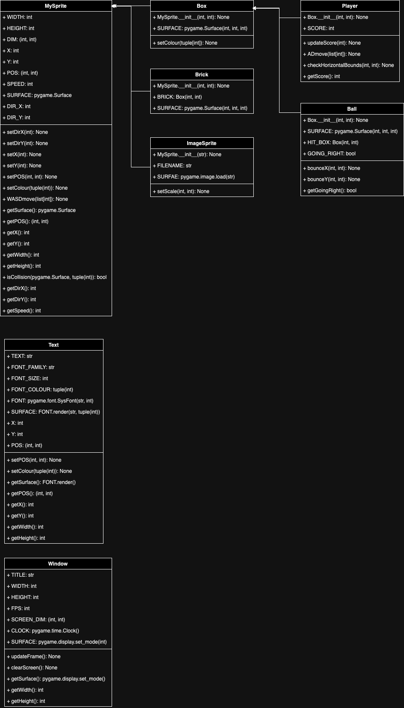
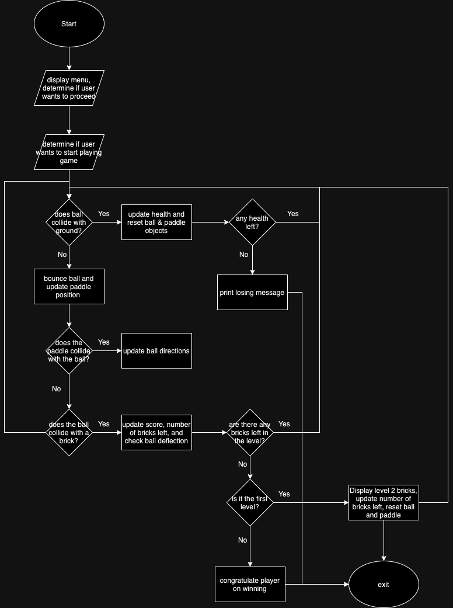

# CSE3130-Project: Brick Breaker!

Basic brick breaker game featuring two levels!

## How to Win the Game
Destroy all the bricks on your screen to complete a level by moving the paddle and preventing the ball from touching the bottom of the screen (you lose a life if this happens). If the ball does hit the bottom of the screen, the paddle and ball position both reset to enable a fair additional chance for players.

If you've successfully destroyed all bricks in the first level, you automatically continue to the second level and have your paddle and ball reset. Don't worry, you also start the next level only after you press SPACE.

Destroy all bricks in the second level to win the game!


## Instructions for Use
Ensure that the ```pygame``` library is installed prior to running the program. 

#### Installation of Pygame
To install in the Pycharm IDE, navigate to your Pycharm settings/preferences. For MAC users, navigate to 'Pycharm' at the top of your screen and go to 'Settings'. For WINDOWS users, navigate to 'File' then 'Settings'.

Afterwards, go to 'Project; {Project Name}' > 'Python Interpreter'. Then, click the '+' and search for "pygame" in the package library and click 'Install Package' and follow the IDE instructions. 


#### Running the Game
Run the game using Pycharm's run button at the top right of the IDE. If the program doesn't run, close Pygame and re-open project folder and then right-click on the ```main.py``` file and manually run the program.

If you run out of lives and lose the game, the window will automatically close; if you win the game, the window will also automatically close. Note the parting message in Pycharm's terminal if you aren't sure whether you won or lost the game :)

## Game Features
Level 1: 36 bricks in total, staggered and spaced out.
Level 2: 18 bricks in total, spaced out more and staggered differently from Level 1 to slightly increase the difficulty.

Points: Players receive 10 points for every brick broken, which accumulates over both levels. 


## Extra Features
1. Starting menu screen
    - This menu is seen when the program first opens and contains instructions on how to move the paddle as well as a summary of the game instructions
2. 3 lives to complete 2 levels
    - The player has 2 extra chances to win the game if the ball touches the bottom of their screen. Lives are represented as hearts and indicated at the top right hand corner of the game.


## Reflection
Overall, this process was more time-consuming and difficult than expected. Initially, I struggled to conceptualize how to structure classes and objects to construct the game, and I often found myself unsure how to use example code to help me create unique classes and objects for Brick Breaker. After planning out and visualizing how I wanted to structure my game, however, the challenge became properly programming the logic. There were various parts of the program that I struggled with coding, but none compared to the logic of the ball bouncing off of the paddle and bricks. I overcomplicated it in numerous ways before I realized that trying to generalize all of the interactions significantly simplified my code into two cases (reflection in one direction and reflection in another direction), which is the part of my program I am most proud of solving. 
## Planning



